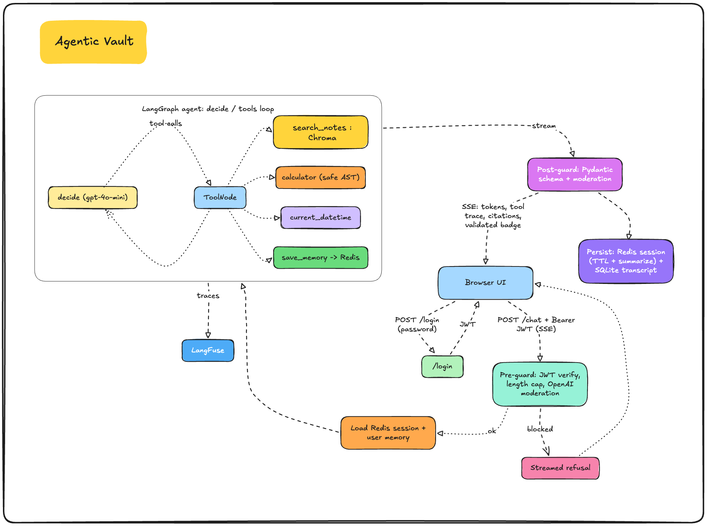

# agentic-vault

A multi-turn, streaming chat agent over a folder of notes. Ask in plain language; a LangGraph agent decides when to search your notes, when to reach for a tool (a calculator, the current date), and when to just answer. It streams the reply token by token, cites the notes it used, remembers the conversation, and remembers facts about you across conversations.

This is Project 2 of a three-project RAG/LLM stack. It builds on [wiki-rag](https://github.com/meowyx/wiki-rag) (one-shot Q&A) and turns it into a proper agentic chat app: the agent drives retrieval instead of a fixed pipeline ("agentic RAG"), wrapped in streaming, sessions, auth, and guards.


---



## What you get

Open `http://localhost:8000`, sign in with your password, and you land in a ChatGPT-style chat:

- **Streaming answers.** Tokens appear as the model writes them, not after a blocking wait.
- **A tool trace.** Each answer shows which tools the agent ran (search, calculator, date) and which notes it pulled.
- **Citations.** The notes the answer is grounded in, shown as chips.
- **Memory.** Tell it your name in one chat and it remembers in the next; a "Memory saved" chip shows when it does.
- **A sidebar** of past conversations, saved to SQLite, so they survive a refresh.
- **An "output validated" badge** when the response passes the output guard.

## One request's path

1. **`/login`** takes a password and returns a JWT (HS256, signed with a local secret). The browser holds it for the session.
2. **`/chat`** (Server-Sent Events) requires that token.
3. **Pre-guard:** length cap + OpenAI moderation. A too-long or flagged message gets a polite refusal and the agent never runs.
4. **Load context:** the conversation's recent history (Redis, summarized when it overflows) plus any saved facts about you (Redis).
5. **The agent** (LangGraph) loops: a `gpt-4o-mini` step decides whether to call a tool or answer. Tools are `search_rust_notes` (vector search over Chroma), `calculator` (a safe AST evaluator, no `eval`), `current_datetime`, and `save_memory`.
6. **Stream out:** tokens, the tool trace, and citations flow to the browser as typed SSE events.
7. **Post-guard:** the finished answer is validated against a Pydantic schema and moderated. If it fails it's swapped for a safe message (fails closed); if it passes you get the validated badge.
8. **Persist:** the turn is appended to the Redis session (sliding TTL) and the SQLite transcript.
9. **LangFuse** traces the whole thing: tool calls, tokens, latency, cost.

## Streaming vs blocking

The point of streaming is perceived latency. Measured on a single-turn answer (median of 5):

- **First token, streaming: ~765 ms**
- **Full response, blocking: ~1.23 s**

First-token time stays roughly flat as answers get longer, while the blocking wait grows with the whole response, so the gap widens the more the model has to say.

## Stack

Python 3.13 (via uv), FastAPI + Pydantic v2, LangGraph + LangChain 1.x, Chroma (local file), Redis 7 (sessions, per-user memory, and the embedding cache), SQLite (stdlib, for the sidebar + transcripts), OpenAI `gpt-4o-mini` + `text-embedding-3-small` + `omni-moderation-latest`, PyJWT (HS256), LangFuse Cloud. The frontend is plain HTML/CSS/JS, no build step. Tests with pytest.

## Quickstart

```bash
git clone https://github.com/meowyx/agentic-vault && cd agentic-vault
uv sync

cp .env.example .env
# fill in: OPENAI_API_KEY, LANGFUSE_PUBLIC_KEY, LANGFUSE_SECRET_KEY,
# LANGFUSE_BASE_URL, REDIS_URL, VAULT_CORPUS_PATH,
# JWT_SECRET   (generate with: openssl rand -hex 32)
# APP_PASSWORD (your login password)

docker compose up -d                          # Redis

uv run python -m agentic_vault.ingest         # build the vector store from your notes
uv run uvicorn agentic_vault.main:app
```

Open http://localhost:8000 and sign in with your `APP_PASSWORD`.

## Day to day

```bash
uv run uvicorn agentic_vault.main:app --reload
```

When you add or edit notes, re-ingest:

```bash
uv run python -m agentic_vault.ingest
```

You don't need to restart the server; it reads `chroma_db/` fresh. Re-ingest is cheap because Redis caches each chunk's embedding, so only new or changed chunks call OpenAI.

## Tests

```bash
uv run pytest
```

Route tests use FastAPI's `TestClient` with the agent, Redis, SQLite, and moderation mocked, so they run offline, fast, and without an API key. They assert the route contract (auth, the SSE event shape, the guards), not the model's wording.

## Decisions worth knowing about

**The agent drives retrieval.** Unlike wiki-rag's fixed retrieve-then-answer pipeline, here the model decides per turn whether to search, use another tool, or just answer. Retrieval is one tool among several.

**Two kinds of memory.** Per-session working memory (Redis, TTL'd, summarized when it overflows so the context stays bounded) is separate from per-user long-term memory (Redis, durable facts the agent chooses to save and reads back in every conversation).

**SQLite for the sidebar, Redis for working memory.** SQLite is the durable record: the conversation list and transcripts that survive restarts. Redis holds the summarized working memory per session. Two stores, two jobs.

**Streaming plus guards is a tradeoff.** Tokens stream live, so the output guard runs after the stream. On a failure the answer is swapped for a safe one and the saved record stays clean, but a flagged token could flash before the swap. The strict alternative (buffer, validate, then send) loses streaming. For a local single-user app, stream-then-validate is the right call.

**The calculator never uses `eval`.** Tool arguments are model-generated, so they're untrusted. The calculator parses to an AST and walks a whitelist of arithmetic operators; anything else is rejected.

## Missing for prod

- A real identity provider (OIDC) instead of a self-signed JWT, with key rotation. A hashed password (bcrypt/argon2) instead of a plaintext one in `.env`, and rate limiting on `/login`.
- Summarization on a background job instead of inline on the hot request path.
- Buffer-then-validate output guarding for sensitive deployments (vs the stream-then-validate here).
- Async SQLite (or Postgres) instead of synchronous writes on the request path.
- A persistent vector store (pgvector or a managed store) instead of a local Chroma file.

## License

MIT. See [LICENSE](LICENSE).
